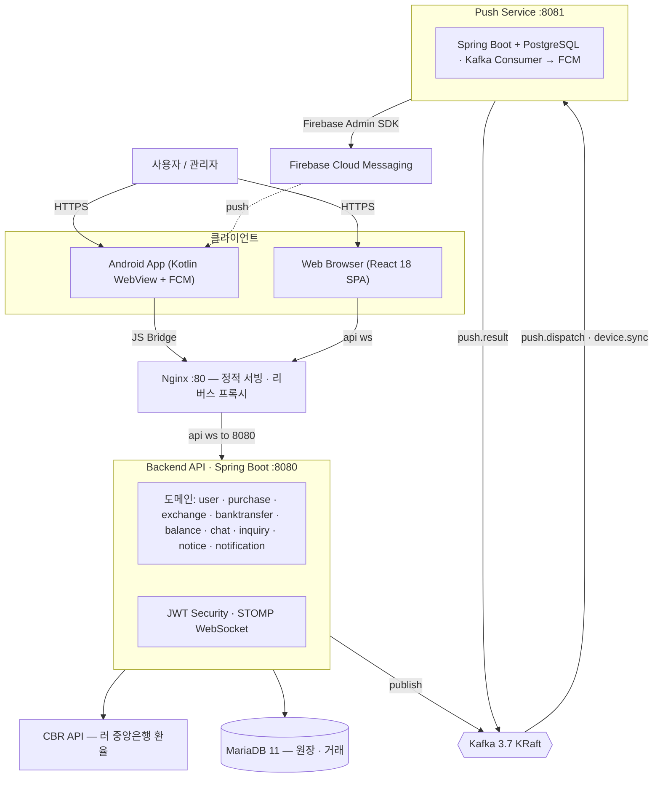
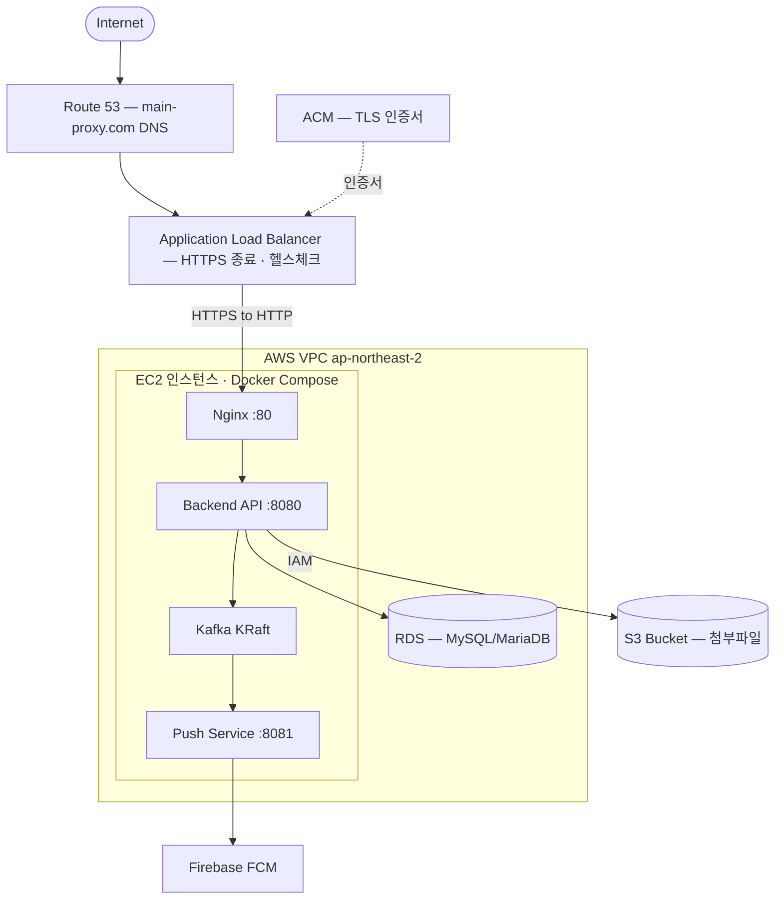

# RuxPress — 한·러 통화 환전 / 구매대행 핀테크 플랫폼

> KRW ↔ RUB 환전과 구매대행을 다국어(한국어·러시아어·영어)로 제공하는 풀스택 금융 서비스 플랫폼입니다.
> **Spring Boot 모놀리식 API + React SPA + Kafka 기반 푸시 마이크로서비스 + Android(WebView) 앱**으로 구성된 멀티 서비스 아키텍처를 직접 설계·구현했습니다.

<p align="left">
  
  
  
  
  
  
  
  
  
  
</p>

> 🌐 **운영 도메인:** [https://main-proxy.com](https://main-proxy.com) — AWS위에서 Route 53 + ALB(HTTPS) + EC2 + RDS + S3로 운영됩니다.

---

## 프로젝트 미리보기
### 사용자 화면 (mobile)
<p align="center">
  
  
  
</p>

### 관리자 화면 (PC)
<p align="center">
  
  
  
</p>

---

## 목차

1. [프로젝트 개요](#1-프로젝트-개요)
2. [핵심 성과 요약](#2-핵심-성과-요약)
3. [시스템 아키텍처](#3-시스템-아키텍처)
4. [기술 스택](#4-기술-스택)
5. [주요 기능](#5-주요-기능)
6. [기술적 도전과 설계 결정](#6-기술적-도전과-설계-결정)
7. [백엔드 상세](#7-백엔드-상세)
8. [프론트엔드 상세](#8-프론트엔드-상세)
9. [푸시 알림 마이크로서비스](#9-푸시-알림-마이크로서비스)
10. [Android 앱](#10-android-앱)
11. [AWS 클라우드 인프라](#11-aws-클라우드-인프라)
12. [배포 · CI/CD](#12-배포--cicd)
13. [개발 도구 · 워크플로우](#13-개발-도구--워크플로우)
14. [로컬 실행 가이드](#14-로컬-실행-가이드)
15. [프로젝트 구조](#15-프로젝트-구조)
16. [개발 타임라인](#16-개발-타임라인-커밋-이력-기반)

---

## 1. 프로젝트 개요

**RuxPress**는 한국과 러시아 사용자를 대상으로 한 환전·구매대행 핀테크 서비스입니다. 사용자는 원화(KRW)와 루블(RUB)을 환전하고, 지갑(잔액)을 충전·관리하며, 실시간 상담을 통해 구매대행을 진행합니다. 관리자는 환율·정산 계좌·입금 검증·사용자 지갑·구매요청 전 과정을 통제합니다.

| 항목 | 내용 |
|------|------|
| **서비스 도메인** | 환전(KRW↔RUB), 구매대행, 전자지갑/잔액, 계좌이체 입금, 1:1 상담 |
| **운영 URL** | [https://main-proxy.com](https://main-proxy.com) (AWS Seoul 리전) |
| **타깃 사용자** | 한국·러시아 양국 사용자 (다국어 필수) |
| **구성** | 4개 독립 실행 단위 (Backend API · Web Frontend · Push Service · Android App) |
| **언어 지원** | 한국어 · 러시아어 · 영어 (기본값: 러시아어) |
| **인프라** | AWS EC2 · ALB(HTTPS) · Route 53 · RDS · S3 + Docker Compose |
| **개발 형태** | 요구사항 기반(REQ-xxx) 기능 브랜치 전략으로 단계적 개발 |

---

## 2. 핵심 성과 요약

이 프로젝트에서 단순 CRUD를 넘어 **실서비스 수준의 엔지니어링 과제**를 직접 해결했습니다.

- 🏦 **금융 원장(Ledger) 설계** — 단순 잔액 컬럼이 아닌 **불변 원장 엔트리(Ledger Entry)** 기반으로 지갑/계좌이체 거래를 기록해 추적성과 정합성을 확보했습니다.
- 🔌 **헥사고날(포트·어댑터) 아키텍처 적용** — 은행 입금 검증을 `BankDepositVerificationPort` 인터페이스로 추상화하여, 수동 검증(`ManualDepositVerificationAdapter`)과 향후 자동 검증(웹훅)을 무중단 교체 가능하게 설계했습니다.
- 📨 **Kafka 기반 비동기 이벤트 파이프라인** — 백엔드와 푸시 서비스를 Kafka 토픽으로 느슨하게 결합하여, 알림 발송 실패가 핵심 트랜잭션에 영향을 주지 않도록 분리했습니다.
- 💬 **STOMP WebSocket 실시간 채팅** — JWT 인증 인터셉터를 통과하는 1:1 실시간 상담 채팅(파일 첨부 + 메시지 보존기간 자동 삭제 배치 포함)을 구현했습니다.
- 🌍 **풀스택 i18n** — 프론트(3개 로케일 JSON) + 백엔드(`Accept-Language` 기반 `MessageSource` 에러 메시지 변환)를 일관되게 다국어화했습니다.
- 📱 **하이브리드 모바일** — React 웹을 WebView로 래핑한 Android 앱에 FCM 푸시 + JS Bridge(인증 토큰 동기화)를 결합했습니다.
- 🚀 **Docker Compose 풀스택 오케스트레이션 + GitHub Actions 자동 배포** — `develop`/`master` 브랜치 푸시 시 SSH 무중단 재배포 파이프라인을 구성했습니다.

**코드 규모 (대략)**

| 구성 | 파일 수 | 비고 |
|------|--------:|------|
| 백엔드 Java | 264 | 14개 도메인, 33개 컨트롤러 |
| 프론트엔드 TS/TSX | 127 | 사용자 18 + 관리자 14 페이지 |
| 푸시 서비스 Java | 20 | Kafka 컨슈머/프로듀서 + FCM |
| Android Kotlin | 6 | WebView + FCM |
| UI 컴포넌트 | 48 | Radix 기반 디자인 시스템 |

---

## 3. 시스템 아키텍처



**아키텍처 설계 의도**
- **모놀리식 + 분리된 푸시 서비스** — 핵심 비즈니스 로직은 응집도 높은 모놀리식으로 유지하되, 외부 의존성(Firebase)과 부하 변동이 큰 푸시 발송만 별도 서비스로 분리해 장애 격리.
- **Kafka로 서비스 간 결합 최소화** — 백엔드는 "알림 발송이 필요하다"는 이벤트만 publish하고, 실제 발송 책임은 푸시 서비스가 consume하여 처리.
- **DB 분리** — 거래/원장은 MariaDB, 푸시 디바이스/발송 이력은 PostgreSQL(Flyway 관리)로 서비스별 독립.

---

## 4. 기술 스택

### Backend (`back/`)
| 분류 | 기술 |
|------|------|
| 언어 / 런타임 | Java 21 |
| 프레임워크 | Spring Boot 3.2.5 (Web, Data JPA, Security, Validation, Mail, WebSocket) |
| 인증 | JWT (jjwt 0.12.5), Spring Security, 역할 기반 접근제어 |
| 메시징 | Spring Kafka |
| 데이터 | MariaDB 11 (prod/dev) · H2 (local/test) |
| 스토리지 | 로컬 파일시스템 ↔ AWS S3 (포트·어댑터로 전환) |
| 외부 연동 | CBR(러시아 중앙은행) 환율 API, SMTP 메일 |

### Frontend (`front/`)
| 분류 | 기술 |
|------|------|
| 코어 | React 18, TypeScript 5.6, Vite 6 |
| 라우팅 | React Router 7 (loader 기반 라우트 가드) |
| UI | TailwindCSS 4, Radix UI(48개 컴포넌트), lucide-react |
| 폼 / 검증 | React Hook Form |
| 차트 | Recharts |
| 실시간 | STOMP.js over WebSocket |
| 테스트 | Vitest + jsdom + coverage-v8 |

### Push Service (`mobilePush/`)
| 분류 | 기술 |
|------|------|
| 프레임워크 | Spring Boot, Spring Kafka |
| 데이터 | PostgreSQL 16 + Flyway 마이그레이션 |
| 푸시 | Firebase Admin SDK (FCM) |

### Android (`app/android/`)
| 분류 | 기술 |
|------|------|
| 언어 | Kotlin (minSdk 24 / targetSdk 36) |
| 핵심 | WebView + JavaScript Bridge, Firebase Messaging, OkHttp, Coroutines |

### Infra & Cloud (AWS)
| 분류 | 기술 |
|------|------|
| 컴퓨팅 | AWS EC2 (Docker Compose 호스트) |
| 네트워크 / HTTPS | Route 53(DNS, `main-proxy.com`), Application Load Balancer(ALB, TLS 종료), ACM 인증서 |
| 데이터베이스 | AWS RDS (MySQL/MariaDB 호환) |
| 오브젝트 스토리지 | AWS S3 (첨부파일, 리전 `ap-northeast-2` 서울) + IAM 전용 사용자 |
| 컨테이너 | Docker · Docker Compose (6개 컨테이너 오케스트레이션) |
| 웹서버 | Nginx (정적 서빙 + 리버스 프록시) |
| 메시징 | Apache Kafka 3.7 (KRaft, ZooKeeper 미사용) |
| CI/CD | GitHub Actions (SSH 기반 무중단 자동 배포) |

### 개발 도구 (Dev Tools)
| 분류 | 도구 |
|------|------|
| AI 페어 프로그래밍 | **Claude Code**, **Cursor** |
| UI/디자인 → 코드 | **Figma Make** (디자인을 React UI로 변환) |
| 컨테이너 / 로컬 인프라 | **Docker** / Docker Compose |
| 버전 관리 / 협업 | Git · GitHub · GitHub Actions |

---

## 5. 주요 기능

### 사용자 (18개 페이지)
- **회원 / 인증** — 이메일 가입·인증, 로그인(자동 로그인/세션 선택), 비밀번호 찾기·재설정
- **환전** — 실시간 KRW↔RUB 환율 조회 및 환전 견적
- **전자지갑** — 잔액 조회, **지갑 원장(Wallet Ledger)** 거래 내역 추적
- **계좌이체 입금** — 입금 신고, 입금 영수증, 정산 계좌 안내
- **구매대행 요청** — 요청 생성·상세·목록, 배송지 스냅샷 관리
- **1:1 상담** — STOMP 실시간 채팅(파일 첨부), 문의 게시판
- **공지사항 / 마이페이지**

### 관리자 (14개 페이지)
- **대시보드** — 통계 집계(`AdminStatsController`)
- **환율 관리** — 자동(CBR) / 수동 환율 설정, 다중 통화 지원
- **계좌이체·정산** — 입금 검증, 정산 계좌 관리, 환불 처리
- **사용자·지갑 관리** — 상태 변경, 지갑 잔액 수동 조정(원장 기록)
- **구매요청 처리** — 상태 전이(v2 상태 머신), 상세 관리
- **상담 채팅** — 관리자 채팅 콘솔, 채팅 보존기간 설정
- **공지·문의·알림·관리자 계정 관리** — 역할 기반(SUPER_ADMIN / COUNSELOR)

---

## 6. 기술적 도전과 설계 결정

### 6.1 금융 정합성 — 불변 원장(Ledger) 패턴
잔액을 단일 컬럼으로 덮어쓰면 거래 추적이 불가능하고 동시성 버그에 취약합니다. 그래서 지갑(`UserWallet`)과 계좌이체(`TransferLedgerEntry`) 모두 **추가만 가능한 원장 엔트리**(`WalletLedgerEntry`, 타입: 충전/차감/관리자 조정 등)로 모든 변동을 기록하도록 설계했습니다. 잔액은 원장의 파생값으로 다루어 **모든 자금 이동에 감사 추적(audit trail)** 이 남습니다. 레거시 데이터는 `TransferLedgerLegacyMigration`으로 원장 모델에 맞춰 이관했습니다.

### 6.2 외부 연동 격리 — 헥사고날 포트·어댑터
은행 입금 확인은 초기엔 관리자 수동 검증이지만, 추후 오픈뱅킹/웹훅 자동화가 예정된 영역입니다. 이를 `BankDepositVerificationPort` 인터페이스로 추상화하고 `ManualDepositVerificationAdapter`로 구현해, **도메인 로직 변경 없이 검증 방식만 교체**할 수 있게 했습니다. 파일 스토리지도 동일하게 `FileStoragePort` → `Local`/`S3` 어댑터로 추상화하여 환경변수(`STORAGE_TYPE`)만으로 전환됩니다.

### 6.3 장애 격리 — Kafka 비동기 푸시 파이프라인
"구매요청 처리"가 성공했는데 "푸시 발송"이 실패해 전체 트랜잭션이 롤백되면 안 됩니다. 백엔드는 `ruxpress.notification.push.dispatch` 토픽으로 **이벤트만 발행**하고, 푸시 서비스가 이를 consume해 FCM으로 발송합니다. 디바이스 토큰 동기화(`user.device.sync`)와 발송 결과(`push.result`)도 토픽으로 분리해, 푸시 시스템 장애가 핵심 거래 흐름과 완전히 격리됩니다. (토픽 스키마는 [`mobilePush/docs/kafka-contracts.md`](mobilePush/docs/kafka-contracts.md))

### 6.4 실시간 채팅 — STOMP + JWT 인증 인터셉터
WebSocket은 HTTP 헤더 기반 인증이 매 메시지마다 적용되지 않습니다. 그래서 STOMP `CONNECT` 시점에 JWT를 검증하는 `ChatAuthChannelInterceptor`와 `ChatPrincipal`을 구현해, 인증된 사용자만 `/topic/chat/{roomId}` 구독·발행이 가능하도록 했습니다. 메시지 보존기간 설정(`ChatRetentionPeriod`)과 **스케줄 배치 자동 삭제**(`ChatMessageCleanupService`)로 개인정보 보존 정책도 충족했습니다.

### 6.5 풀스택 다국어 (i18n)
- **프론트**: `ko.json`/`ru.json`/`en.json` 로케일 리소스 + `I18nProvider`, `localStorage` 저장 언어를 `Accept-Language` 헤더로 전송.
- **백엔드**: `MessageConfig` + `MessageSource`로 **에러 메시지까지 로케일 변환** — 단순 UI 번역을 넘어 `BusinessException`의 메시지 키가 사용자 언어로 응답됩니다.
- 첫 방문 시 러시아어 기본값, 레거시 저장값(`ko`) 무시 등 실제 운영 이슈까지 반영.

### 6.6 인증 토큰 저장 전략 (프론트)
"자동 로그인"과 "이번 세션만"을 모두 지원하기 위해 `sessionStorage`를 우선 확인하고 없으면 `localStorage`를 사용하는 추상화(`readAuthValue`/`writeAuthValue`)를 두었습니다. 인증 상태 변화는 커스텀 이벤트(`USER_AUTH_CHANGE_EVENT`)로 브로드캐스트하고, Android WebView에서는 JS Bridge로 토큰을 동기화합니다.

---

## 7. 백엔드 상세

### 도메인 구조 (`back/src/main/java/com/ruxpress/domain/`)
계층형(Controller → Service → Repository) 패턴을 14개 도메인에 일관 적용했습니다.

| 도메인 | 책임 |
|--------|------|
| `user` | 가입·로그인·JWT·이메일 인증·주소·디바이스 |
| `exchange` | CBR API 환율 수집(`CbrApiClient`), 수동/자동 환율, 다중 통화 |
| `balance` | 전자지갑(`UserWallet`) + 지갑 원장(`WalletLedgerEntry`) |
| `banktransfer` | 계좌이체 입금, 정산 계좌, 입금 검증 포트, 계좌 마스킹 |
| `purchase` | 구매대행 요청 생명주기, 배송지 스냅샷, 상태 머신 v2 |
| `chat` | STOMP 실시간 채팅, 첨부, 보존기간 자동 삭제 |
| `inquiry` / `notice` | 1:1 문의 / 공지 |
| `notification` / `adminnotification` | 사용자/관리자 인앱 알림 |
| `transaction` | 거래 내역 |
| `admin` | 관리자 계정·역할 관리 |

### 공통 모듈 (`common/`)
- **`ApiResponse<T>`** — 모든 컨트롤러가 `code`/`message`/`data` 표준 응답 반환, `null` 데이터는 JSON에서 제외.
- **`BaseEntity`** — 모든 JPA 엔티티가 상속, `id`/`createdAt`/`updatedAt`/`deletedAt`(소프트 삭제) 제공.
- **`Attachment`** — `AttachmentRefType` 디스크리미네이터로 첨부 메타데이터 공용 관리.
- **글로벌 예외 처리** — `ErrorCode` + `BusinessException` + `GlobalExceptionHandler` 중앙 집중.

### 보안 (`config/`)
- `JwtAuthenticationFilter`가 매 요청 `Authorization: Bearer` 헤더에서 주체(사용자/관리자 ID)와 역할을 추출.
- 역할: `SUPER_ADMIN` · `COUNSELOR` · `USER` (JWT 페이로드에 임베드).
- CORS, 업로드 크기(파일당 10MB / 요청당 60MB), ALB 프록시 헤더 등 운영 설정 반영.

### Spring 프로필
| 프로필 | DB | Kafka | DDL |
|--------|------|------|-----|
| `local` (기본) | H2 in-memory | localhost:9092 | validate |
| `dev` | MariaDB | localhost:9092 | validate |
| `docker` | MariaDB(`mariadb` 호스트) | kafka:29092 | update |
| `prod` | MariaDB(env) | env 기반 | — |

---

## 8. 프론트엔드 상세

- **진입 흐름**: `main.tsx` → `Root.tsx` → `routes.ts` 라우트 정의.
- **라우트 가드**: React Router 7 loader 함수(`requireUserAuth`, `requireAdminAuth`, `redirectIfAuthenticated` 등)가 렌더 전에 토큰/역할을 검사.
- **API 계층**: `api/` 모듈로 도메인별 호출 추상화, `utils/api.ts` 공통 fetch 래퍼.
- **커스텀 훅**: `useChat`, `useBalance`, `useExchangeRate`, `usePurchase`, `useAndroidBridge`, `useTranslation`.
- **디자인 시스템**: Radix UI 기반 48개 재사용 컴포넌트(`components/ui/`) + Tailwind 4.
- **테스트**: Vitest로 `authStorage`, `bankTransfer`, `i18n` 등 핵심 유틸 단위 테스트.

```bash
npm run dev      # :3000 (/api·/ws → :8080 프록시)
npm run build    # tsc 타입체크 + Vite 빌드
npm test         # Vitest 단일 실행
```

---

## 9. 푸시 알림 마이크로서비스

`mobilePush/` — Kafka 컨슈머로 동작하는 독립 Spring Boot 서비스.

- **`PushDispatchKafkaListener`** → `FcmDispatchService` → Firebase Admin SDK로 FCM 발송.
- **`UserDeviceSyncKafkaListener`** → 사용자 디바이스 토큰(`PushDevice`) 동기화.
- **발송 이력**(`PushDeliveryAttempt`)을 PostgreSQL에 기록, Flyway(`V1__push_schema.sql`)로 스키마 관리.
- Firebase 자격증명은 Docker secret(`/run/secrets/firebase-admin.json`)으로 주입.

**Kafka 토픽**

| 토픽 | 방향 | 용도 |
|------|------|------|
| `ruxpress.notification.push.dispatch` | Backend → Push | FCM 푸시 트리거 |
| `ruxpress.user.device.sync` | Backend → Push | 디바이스 토큰 동기화 |
| `ruxpress.notification.push.result` | Push → Backend | 발송 결과(선택) |

---

## 10. Android 앱

`app/android/` — React 웹을 감싸는 하이브리드 앱.

- **WebView 래핑**: `MainActivity`가 운영 웹을 로드(개발 시 `local.properties`의 LAN IP/에뮬레이터 `10.0.2.2`로 전환).
- **JS Bridge**(`WebAppInterface`): 웹↔네이티브 양방향 통신으로 인증 토큰·푸시 컨텍스트(`PushContextSync`) 동기화.
- **FCM 수신**(`RuxpressFcmService`): 백그라운드 푸시 알림 처리.
- **릴리스 서명**: `keystore.properties` 기반 서명 설정(예시 파일 제공).

---

## 11. AWS 클라우드 인프라

운영 환경(`https://main-proxy.com`)은 **AWS 서울 리전(`ap-northeast-2`)** 위에 구축되어 있습니다.



### 구성 요소

| AWS 서비스 | 역할 | 비고 |
|-----------|------|------|
| **Route 53** | `main-proxy.com` / `www.main-proxy.com` DNS 라우팅 | CORS 허용 도메인과 일치 |
| **ALB (Application Load Balancer)** | HTTPS(TLS) 종료, 트래픽 분산, 헬스체크 | `X-Forwarded-*` 프록시 헤더로 원본 IP/프로토콜 전달 |
| **ACM** | TLS 인증서 발급·자동 갱신 | ALB에 연결 |
| **EC2** | Docker Compose 풀스택 호스팅 | `setup-swap.sh`로 스왑 구성 |
| **RDS** | 관리형 관계형 DB (거래·원장) | 셋업 스크립트 `script/aws/.../03-rds-mysql` |
| **S3** | 첨부파일 오브젝트 스토리지 | `FileStoragePort`의 S3 어댑터, 전용 IAM 사용자 |
| **IAM** | S3 접근 최소권한 사용자 | `02-iam-s3-user` 스크립트로 생성 |

> AWS 리소스 프로비저닝은 `script/aws/`에 **Linux(sh)·Windows(PowerShell) 양쪽 IaC 스크립트**로 자동화되어 있습니다 — DB 서브넷 그룹 → S3 버킷 → IAM 사용자 → RDS 순서(`run-all`).

### EC2 내부 — Docker Compose 풀스택
`docker-compose.yml` 하나로 6개 컨테이너 오케스트레이션:
`mariadb` · `kafka`(KRaft) · `push-postgres` · `mobilepush` · `backend` · `frontend(nginx)` — healthcheck 기반 의존성 순서 제어.

| 서비스 | 포트 | 비고 |
|--------|------|------|
| Frontend (Nginx) | 80 | 정적 서빙 + 리버스 프록시 (업로드 60MB 제한) |
| Backend API | 8080 | `/api/health` 헬스체크 |
| Push Service | 8081 | FCM 디스패처 |
| Kafka | 9092(host) / 29092(내부) | KRaft 모드 |
| MariaDB / RDS | 3306 | 거래/원장 |
| PostgreSQL(push) | 5433 | 푸시 전용 |

---

## 12. 배포 · CI/CD

### GitHub Actions 자동 배포
| 트리거 | 워크플로우 | 동작 |
|--------|-----------|------|
| `develop` push | `deploy-dev.yml` | 개발 서버 SSH 접속 → `rebuild.sh` |
| `master` push | `deploy-prod.yml` | 운영 EC2 SSH 접속 → `rebuild.sh` |

- 서버 배포 경로: `/svc/RuxPress`
- 흐름: **코드 push → Actions가 SSH → 이미지 재빌드 → 컨테이너 무중단 교체**

### 운영 스크립트 (`script/`)
| 스크립트 | 설명 |
|----------|------|
| `init.sh` | 서버 최초 환경 구성(패키지·Docker 설치, clone, 이미지 빌드) |
| `manage.sh` / `.bat` | start / stop / restart |
| `rebuild.sh` / `.bat` | 중지 → 이미지 재빌드 → 시작 (무중단 재배포) |
| `setup-swap.sh` | 저사양 EC2 스왑 메모리 설정 |
| `aws/linux/*.sh`, `aws/windows/*.ps1` | AWS 리소스(S3·IAM·RDS) 프로비저닝 IaC |

---

## 13. 개발 도구 · 워크플로우

이 프로젝트는 **AI 페어 프로그래밍**과 **디자인→코드 자동화** 도구를 적극 활용해 생산성을 높였습니다.

| 도구 | 용도 |
|------|------|
| 🤖 **Claude Code** | AI 페어 프로그래밍 — 도메인 설계, 리팩터링, 다국어 처리, 코드 리뷰 |
| 🖱️ **Cursor** | AI 코드 에디터 — 인라인 편집·자동완성 |
| 🎨 **Figma Make** | 디자인 시안을 React UI 컴포넌트로 변환 (프론트 디자인 시스템 기반) |
| 🐳 **Docker / Docker Compose** | 로컬·운영 동일 컨테이너 환경 |
| 🔧 **Git · GitHub · GitHub Actions** | 기능 브랜치(REQ-xxx) 전략 + CI/CD 자동 배포 |

---

## 14. 로컬 실행 가이드

### 사전 요구사항
Docker & Docker Compose / (개별 실행 시) JDK 21, Node 18+

### 전체 스택 (권장)
```bash
docker compose up -d        # 전체 기동
docker compose down         # 전체 중지
./script/rebuild.sh         # 이미지 재빌드 후 재시작
```

### 개별 실행
```bash
# 백엔드 (H2 + 로컬 Kafka)
cd back && mvn spring-boot:run

# 프론트엔드 (:3000)
cd front && npm install && npm run dev

# 푸시 서비스 (인프라 먼저: docker compose up -d kafka push-postgres)
cd mobilePush && mvn spring-boot:run -Dspring-boot.run.profiles=local
```

### 접속 URL
| 서비스 | URL |
|--------|-----|
| 프론트엔드 | http://localhost |
| 백엔드 API | http://localhost:8080 |
| Health Check | http://localhost:8080/api/health |
| H2 Console (local) | http://localhost:8080/h2-console |

---

## 15. 프로젝트 구조

```
ruxpress/
├── back/                      # Spring Boot 모놀리식 API (Java 21)
│   └── src/main/java/com/ruxpress/
│       ├── common/            # ApiResponse · BaseEntity · Attachment · 예외처리 · 스토리지 포트
│       ├── config/            # Security · JWT · Kafka · WebSocket · i18n · CORS
│       └── domain/            # user · exchange · balance · banktransfer · purchase
│                              # · chat · inquiry · notice · notification · transaction · admin
├── front/                     # React 18 + TS + Vite SPA
│   └── src/
│       ├── pages/             # user(18) · admin(14)
│       ├── api/ · hooks/      # 도메인 API 계층 · 커스텀 훅
│       ├── components/ui/     # Radix 기반 디자인 시스템(48)
│       └── i18n/              # ko · ru · en
├── mobilePush/                # Kafka 컨슈머 + FCM 푸시 마이크로서비스
│   ├── src/main/java/.../push # config · dispatch · device · kafka · domain
│   └── docs/kafka-contracts.md
├── app/android/               # Kotlin WebView 하이브리드 앱 + FCM
├── script/                    # init · manage · rebuild · setup-swap
│   └── aws/                    # AWS 프로비저닝 IaC (S3 · IAM · RDS) — sh/ps1
├── sql/                       # DDL + 마이그레이션 스크립트
├── .github/workflows/         # deploy-dev.yml · deploy-prod.yml
└── docker-compose.yml         # 6-컨테이너 풀스택 오케스트레이션
```

---
